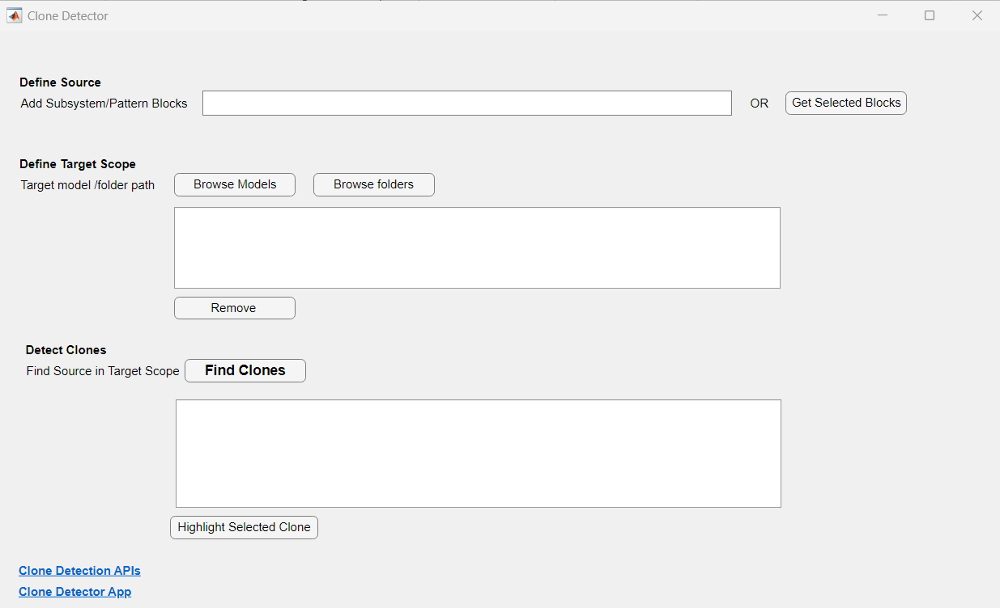

# extension-for-clone-detector
Extension for Clone Detector

  

Extension for Clone Detector:
---------------------------------------------------------------------
When fixing a bug or enhancing a functionality Simulink users have to 
search for all the clone/duplicate instances of the functionality 
manually in a model or across multiple Simulink models which is 
tedious and time consuming task.

We are here to make the above experience efficient to search a 
Simulink blocks pattern in a target scope which can be models or folders.

<!--- Markdown supports the following HTML entities: © - &copy;  ® - &reg;  ™ - &trade;
More information about Trademarks can be found internally within the Checklist for Community Contributions and Supportfiles Confluence page--->

## Setup 
To Run:
1. Download the zip file
2. Ensure that it contains "findClonesOfSource.m" and "cloneDetection_Matlab_App.mlapp" files.
3. Open the mlapp and run it. It will open a Clone Detector MATLAB&reg; App

### MathWorks Products (https://www.mathworks.com)

Requires MATLAB release R2021a or newer
- [Simulink&reg; Check&trade;](https://www.mathworks.com/products/simulink-check.html)

## Getting Started 
1. Open the Clone Detector MATLAB&reg; App as mentioned in the Setup
2. Open a model and select a blocks pattern you want to search. 
Click on "Get Selected Blocks" in the GUI. This will fetch the selected blocks and 
adds them to the "Define Source" text field.
3. Click on "Browse Models" or "Browse Folders" to select 
Target Scope where you want to search the above blocks pattern
4. Click on "Find Clones" button and wait for the results
5. When clone detection is complete, you can explore the clones which 
are grouped per model. You can select a clone region and click on 
"Highlight Selected Clone" to highlight that in the respective model.
6. If you want to use script/API workflow, you can do so by calling the 
findClonesOfSource function with passing the sourceBlocksPath, targetScopeList
to it.

[Clone Detector App screenshot](screenshots/clone_detector_app.png)

## Contents
readme.md                           This file. 
license.txt                         License file. 
security.md                         Security statement. 
findClonesOfSource.m                Scipt which call Simulink Check APIs and aggregates the results 
cloneDetection_Matlab_App.mlapp     MATLAB App GUI interface to detect clones and show results 

## Examples
To learn how to use this in testing workflows, see [Examples](/examples/). 

## License
The license is available in the license.txt file in this GitHub repository.

## References
Clone Detection official API documentation: https://www.mathworks.com/help/slcheck/ug/clone-detection-programmatically.html 
Clone Detector Simulink Toolstrip App documentation: https://www.mathworks.com/help/slcheck/ug/identify-subsystem-clones-and-replace-them-with-library-blocks.html

## Community Support
[MATLAB Central](https://www.mathworks.com/matlabcentral)

Copyright 2023 The MathWorks, Inc.

